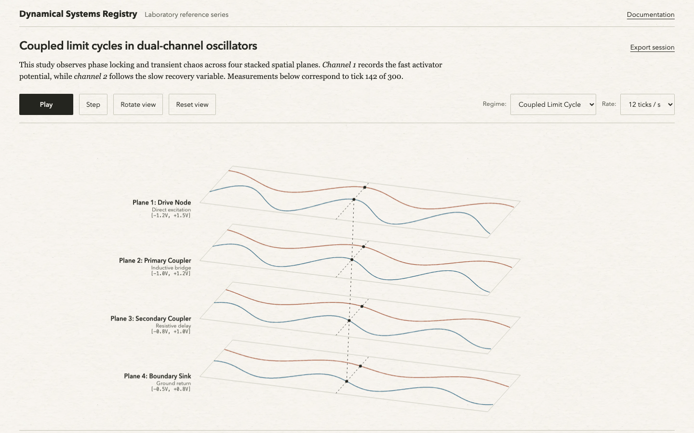
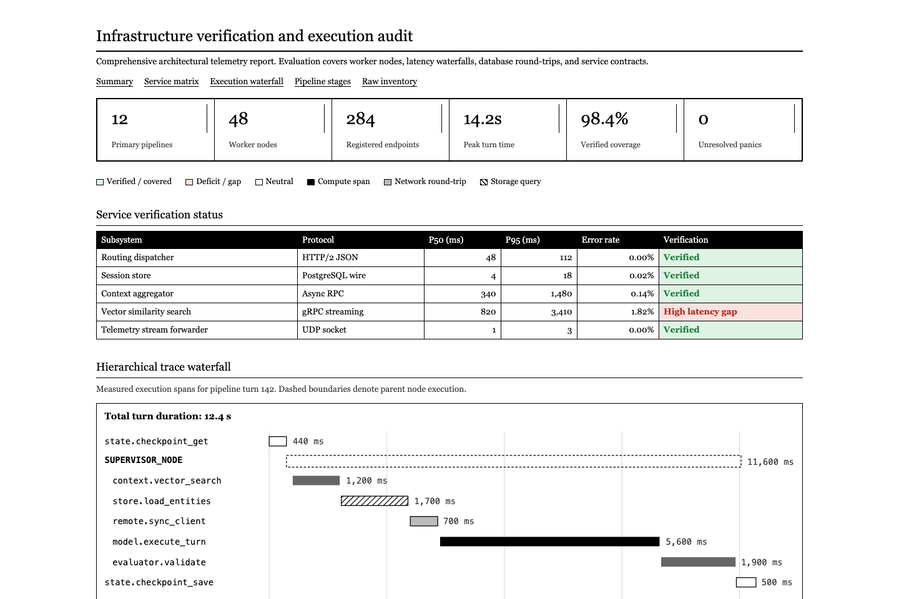
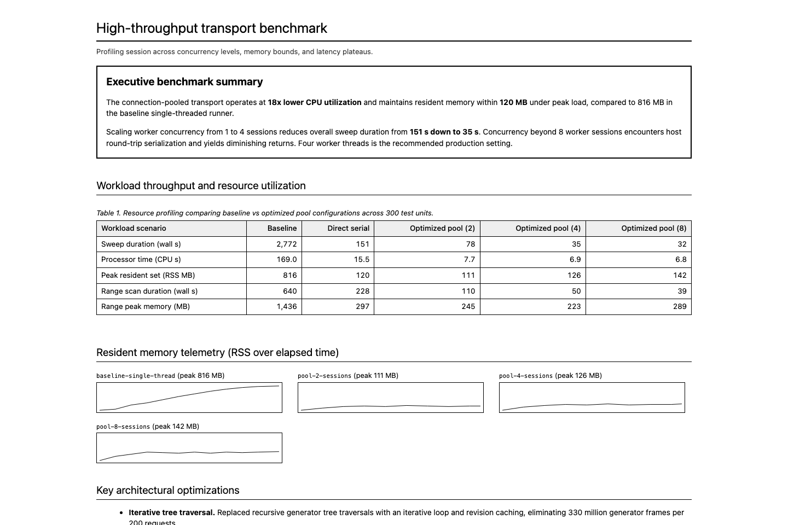

# Design specs

A public catalogue of reusable interface design systems. Each specification captures visual rules, tokens, layout constraints, and component behaviors well enough to reproduce an interface in that exact aesthetic.

All entries follow [Google's DESIGN.md format specification](https://raw.githubusercontent.com/google-labs-code/design.md/main/docs/spec.md), combining machine-readable YAML frontmatter tokens with structured human guidance.

## Design philosophy

Every design in this catalogue enforces strict design discipline to eliminate AI slop:

- **Data over prose:** Multi-paragraph narrative summaries are replaced by dense data tables, execution waterfalls, metric strips, and sparklines.
- **Instrument-grade clarity:** Every UI element serves an analytical purpose. Decorative icons, glowing trace effects, marketing banners, and functionless status pills are prohibited.
- **Precision microcopy:** Labels and notes state concrete mechanisms, physical units, and numerical bounds. Conversational throat-clearing, greeting banners, and em dashes are eliminated.
- **Zero remote dependencies:** Type stacks rely entirely on native system fonts and local assets, avoiding third-party font downloads and runtime bloat.

## Catalogue

| Design | Visual character | Specification | Example | Preview |
| --- | --- | --- | --- | --- |
| Paper dynamics | Warm paper texture, fine rules, restrained wireframe plots, and readable measurements | [design.md](designs/paper-dynamics/design.md) | [example.html](designs/paper-dynamics/example.html) | [preview.png](designs/paper-dynamics/preview.png) |
| Broadsheet audit | High-contrast editorial broadsheet with serif body text, ruled data tables, summary strips, execution waterfalls, and restrained semantic tinting | [design.md](designs/broadsheet-audit/design.md) | [example.html](designs/broadsheet-audit/example.html) | [preview.png](designs/broadsheet-audit/preview.png) |
| Systems benchmark | High-density system sans-serif benchmark report with shaded tabular data, executive callout boxes, and responsive sparkline telemetry grids | [design.md](designs/systems-benchmark/design.md) | [example.html](designs/systems-benchmark/example.html) | [preview.png](designs/systems-benchmark/preview.png) |

## Previews

### Paper dynamics


### Broadsheet audit


### Systems benchmark


## Using a design

Each entry lives in its own folder under `designs/` and contains a complete `design.md` file, an interactive `example.html` implementation, a rendered `preview.png`, and any required visual assets.

### For engineers

1. Open the target directory under `designs/<name>/`.
2. Inspect `design.md` for colors, font families, scale ratios, spacing units, and component anatomy.
3. Open `example.html` in a browser to inspect the live layout, interactive states, and component hierarchy.
4. If an `assets/` subfolder exists (such as textures or icons), copy the files into your project's public directory.
5. Implement the components using the CSS properties, layout constraints, and responsive breakpoints documented in the spec.

### For AI coding agents

Provide the raw markdown text of any `design.md` to your agent as a design context prompt or attach it directly in your workspace. AI coding assistants parse the YAML frontmatter to extract tokens directly and apply the layout rules and component guidelines when generating code.

Because each specification explicitly prohibits conversational padding, em dashes, and decorative cards, generating agents produce compact, data-dense interfaces rather than generic AI mockups.

## Repository structure

Each design directory follows this layout:

```text
designs/
  <design-name>/
    design.md      # Normative tokens and markdown design guidance
    example.html   # Self-contained HTML reference implementation
    preview.png    # Rendered screenshot of the reference implementation
    assets/        # Optional textures, patterns, and visual media
```

The document follows the eight canonical sections:
1. Overview
2. Colors
3. Typography
4. Layout
5. Elevation & depth
6. Shapes
7. Components
8. Do's and Don'ts

Specifications exclude project-specific logic, private API routes, and backend code. They contain only the reusable visual system.

## Contributing

New designs and corrections are welcome.

1. Fork the repository and create a feature branch.
2. Add a new directory under `designs/<design-slug>/`.
3. Create a `design.md` following Google's DESIGN.md token schema and section order.
4. Create an `example.html` file demonstrating the components and responsive behavior.
5. Capture a rendered screenshot and save it as `preview.png`.
6. Ensure all writing uses plain language, sentence case headings, and avoids em dashes or promotional filler.
7. Add an entry to the catalogue table in this file.
8. Submit a pull request. The CI workflow verifies that the specification passes format validation.

## License

MIT. See [LICENSE](LICENSE) for details.
