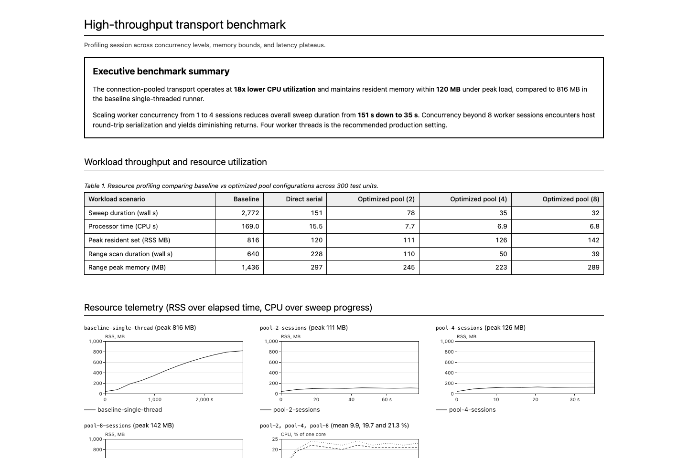

# Systems benchmark

## Overview

A high-density systems engineering layout built for benchmark comparisons, performance regressions, resource profiling, and hardware profiling reports. The interface pairs clean native system typography with compact tabular data, prominent callout boxes, and responsive grids of small telemetry charts with labelled axes.

This design enforces extreme brevity, high tabular density, and concrete telemetry. It forces the interface to communicate through numbers: wall-clock durations, CPU seconds, memory allocations (RSS MB), and charted trends read against a labelled scale. Prose is strictly confined to constrained 80-character notes that name specific algorithmic changes and physical bottlenecks. Meaningless filler, generic recommendations, and multi-paragraph commentary are prohibited.

Use this design when presenting performance evaluations across multiple runs, configurations, or pool sizes. The visual tone is utilitarian and objective. Rather than heavy branding or decorative graphics, the layout relies on crisp 1px and 2px black rules, light neutral grey table headers, and tabular numerals to make comparisons easy to parse.

## Colors

The palette is strictly neutral, focusing on ink contrast and subtle grey surface shading.

### Primary
- **Solid Black (`#000000`):** Core body text, major 2px borders, 1px table rules, chart frames, axis ticks, and chart traces.
- **Pure White (`#ffffff`):** Page background, table cell fill, callout box interior, and chart plot area.

### Neutral & surface
- **Header Wash Grey (`#eeeeee`):** Light neutral fill for table header rows (`th`).
- **Charcoal (`#333333`):** Small subtitles, captions, chart axis text, chart legends, and secondary notes.
- **Fine Rule Grey (`#dddddd`):** Horizontal gridlines inside chart frames, and nowhere else.

| Token | Name | Value | Role |
| --- | --- | --- | --- |
| `primary` | Solid black | `#000000` | Text, borders, dividing rules, axis ticks, and chart traces |
| `background` | Pure white | `#ffffff` | Page background, table cells, and chart plot area |
| `surface` | Pure white | `#ffffff` | Callout box and card surfaces |
| `surface-container` | Header wash grey | `#eeeeee` | Shaded table header backgrounds |
| `outline` | Solid rule | `#000000` | Borders for tables, boxes, and chart frames |
| `outline-variant` | Fine rule grey | `#dddddd` | Horizontal gridlines inside chart frames |
| `neutral-variant` | Charcoal | `#333333` | Subtitles, figure labels, chart axis text, chart legends, and footnotes |

Do not add colored status pills, gradient fills, or accent colors. High-contrast monochrome rules ensure clean reproduction across screens and print.

## Typography

The typography uses the operating system's native sans-serif stack paired with a monospace font for identifiers and code:
- **System sans stack:** `-apple-system, BlinkMacSystemFont, "Segoe UI", Roboto, Helvetica, Arial, sans-serif`
- **Monospace stack:** `Menlo, Consolas, monospace`

| Role | Family | Size / Leading | Weight & Treatment |
| --- | --- | --- | --- |
| Document title (`h1`) | Sans | 22.4px / 1.2 | 400 normal, 2px solid bottom rule |
| Section title (`h2`) | Sans | 16.8px / 1.3 | 400 normal, 1px solid bottom rule |
| Subheading (`h3`) | Sans | 14px / 1.3 | 700 bold |
| Body text | Sans | 14px / 1.45 | 400 normal, capped at 80ch |
| Table text | Sans | 14px / 1.4 | 400 normal, tabular numbers |
| Table caption | Sans | 14px / 1.4 | 400 normal, italic |
| Figure caption | Sans | 11.2px / 1.3 | 400 normal |
| Chart axis text | Sans | 10px / 1 | 400 normal, charcoal (`#333333`), tabular numbers |
| Chart legend | Sans | 11.2px / 1.3 | 400 normal, charcoal (`#333333`) |
| Small footnote | Sans | 11.5px / 1.3 | 400 normal, charcoal (`#333333`) |
| Code & pre | Monospace | 12.6px / 1.4 | 400 normal |

Numeric data in tables and charts uses `font-variant-numeric: tabular-nums` so numbers align reliably in vertical columns. Microcopy must remain objective and brief. Eliminate em dashes and marketing adverbs.

## Layout

The document centers inside a `1120px` max-width container with `2rem` vertical margins and `1rem` horizontal padding:

1. **Document title:** Single line header with a 2px solid black underline.
2. **Executive callout box:** Ruled container highlighting top-line speedups and resource reductions.
3. **Context & narrative:** Structured sections with an 80-character reading line limit (`max-width: 80ch`).
4. **Benchmark summary tables:** Dense data tables with right-aligned numeric figures.
5. **Telemetry chart grid:** Multi-column responsive grid of small-multiples line charts, each with labelled axes, a unit, and a legend.
6. **Detailed analysis lists:** Numbered or bulleted findings with bold inline lead-ins.
7. **Collapsible details:** Native `
` tags housing secondary datasets and raw runs.

### Responsive breakpoints

| Viewport Width | Adjustments |
| --- | --- |
| Above 720px | Multi-column chart grid (`repeat(auto-fill, minmax(340px, 1fr))`) |
| 720px and below | Chart grid stacks into a single column, horizontal table scroll enabled |

All tables maintain horizontal overflow protection through parent scroll wrappers.

## Elevation & depth

Surfaces are strictly flat. The layout uses no box shadows, elevation layers, or blur effects.

Depth and hierarchy rely on:
- **Rule weight hierarchy:** 2px rules define document headers and executive callout frames. 1px rules enclose tables, chart frames, and section breaks.
- **Tonal shading:** Shaded `#eeeeee` table headers create clear separation between column labels and data rows.
- **Framed containers:** Distinct `.box` callouts separate executive findings from general narrative flow.

## Shapes

Geometry is strictly rectilinear:
- **Corners:** Every element uses `border-radius: 0px`. This applies to callout boxes, table borders, chart frames, and code blocks.
- **Stroke rules:**
  - 2px solid black: Title bottom rule and executive callout box border.
  - 1px solid black: Section bottom rules, table cell borders, chart frames, axis ticks, and chart traces.
  - 1px fine rule grey (`#dddddd`): Horizontal chart gridlines.

## Components

### Executive callout box

A prominent container placed near the top of the report to display critical findings, key metrics, and recommended settings:
- Border: `2px solid #000000`.
- Padding: `0.8rem 1rem 1rem`.
- Margin: `1rem 0 2rem`.
- Title: `h2` inside the box with `margin-top: 0; border: 0` to eliminate duplicate dividing rules.
- Content rule: State verified performance multipliers (such as `18x lower CPU` or `151s down to 35s`) and concrete recommendations directly. Never add greeting text, introductory throat-clearing, or conversational commentary.

### Shaded benchmark tables

Compact tabular structures optimized for comparing benchmarks across workloads and configurations:
- Framework: `border-collapse: collapse; width: 100%; margin: 0.6rem 0`.
- Borders: `1px solid #000000` on all cells.
- Padding: `3px 6px` per cell.
- Header (`th`): Filled with `#eeeeee`, normal font weight, 1px solid black border.
- Text alignment:
  - First column (`th:first-child`, `td:first-child`, `td.l`): Left-aligned for workload names or metrics.
  - Value columns (`td`, `th`): Right-aligned with `font-variant-numeric: tabular-nums`.
- Captions: Placed above the table, left-aligned, set in italic text (`font-style: italic`).

### Telemetry chart grid (Signature Component)

A small-multiples grid of compact SVG line charts tracking memory, CPU, latency, or cost over time. Every chart carries its own axes, unit, scale, and legend. A bare trace in a box is not a chart:
- Grid layout: `display: grid; grid-template-columns: repeat(auto-fill, minmax(340px, 1fr)); gap: 1rem`.
- Figure container: `margin: 0`.
- Caption (`figcaption`): Top label set at `11.2px` with monospace series names (`code`) and explicit peak value annotations.
- SVG chart (`svg.chart`):
  - Dimensions: `width="340" height="150" viewBox="0 0 340 150"`, `display: block; max-width: 100%; height: auto`.
  - Plot frame: `rect` at `x="44" y="16"`, `288` wide and `110` high, `fill="none" stroke="#000000" stroke-width="1"`.
  - Axis text: `10px` system sans, charcoal (`#333333`), tabular numbers.
  - Y unit: Written once above the frame at `x="44" y="10"`, naming the measure and its unit, such as `RSS, MB` or `USD per day`.
  - Y scale: Linear and zero-based. The top of the frame is a round number at or above the peak. 4 to 6 ticks sit on steps of 1, 2, 2.5, or 5 times a power of ten. Each tick is a 4px mark left of the frame with a right-aligned label at `x="38"`.
  - Gridlines: One `1px` rule in fine rule grey (`#dddddd`) per interior y tick, drawn inside the frame. No vertical gridlines.
  - X scale: 3 to 6 ticks on round values or calendar dates. Each tick is a 4px mark under the frame with a centered label at `y="142"`. The last label of a numeric axis carries the unit, such as `60 s` or `100 %`. Dates are written `Aug 1`. Labels never touch. Drop a tick before two labels collide.
  - Trace: `polyline` with `fill="none" stroke="#000000" stroke-width="1"`. A second trace on the same frame uses `stroke-dasharray="4 3"` and a third uses `stroke-dasharray="1 3"`. A frame holds at most three traces.
- Legend: Required under every frame. See Chart legend.
- Shared scale: Figures that show the same measure for different runs use one y scale, so heights compare across the grid. Figures that show different measures get their own scale.
- Multi-run comparison: Supports placing multiple figures side-by-side to visually identify memory leaks, plateaus, and spikes.

### Chart legend

A row under every chart frame with one key per trace. A reader must be able to name each trace from the legend alone, without the caption, the surrounding prose, or a hover state:
- Container: `p.legend` inside the `figure`, directly after the SVG chart. `display: flex; flex-wrap: wrap; gap: 0 12px; margin: 2px 0 0`.
- Text: `11.2px / 1.3`, charcoal (`#333333`), tabular numbers.
- Trace key (`svg.key`): `width="24" height="8" viewBox="0 0 24 8"` holding one `line` from `0,4` to `24,4` drawn in the trace's own stroke and dash pattern. `vertical-align: middle; margin-right: 4px`. The series name follows the key.
- One key per trace, in draw order. A key repeats its trace's stroke exactly. A line is never keyed with a filled swatch.
- A single-trace chart still has a legend. The axis names the unit and the legend names the series.
- A sampling note may follow the keys, such as `weekly means`.

### Narrative notes blocks

Constrained reading passages for technical explanations and postmortem context:
- Container class: `.notes`.
- Line width: Constrained to `max-width: 80ch` on paragraphs and list items.
- Content rule: Explain specific technical constraints, bottlenecks, and mechanisms. Omit speculative adjectives and conversational padding.

### Performance gain lists

Unordered lists documenting specific architectural changes and speedups:
- Class: `ul.gain`.
- Items: Spaced at `margin: 0.2rem 0` with bold leading phrases naming the mechanism, followed immediately by the measured speedup or memory delta.

### Collapsible details

Native disclosure element for raw logs and secondary runs:
- Container: `details { margin: 0.4rem 0 }`.
- Summary: `summary { cursor: pointer; font-weight: 500 }`.

## Do's and Don'ts

- **Do** document performance changes with concrete numbers, measured deltas, and memory peaks.
- **Do** lead optimization bullets with the concrete mechanism followed by the measured result.
- **Do** maintain strict 80-character width limits on prose to prevent rambling explanations.
- **Do** use native system sans-serif typography (`-apple-system, sans-serif`) for crisp, platform-native rendering.
- **Do** set table numerals to tabular numbers (`tabular-nums`) and right-align all metric values.
- **Do** wrap figures in a responsive CSS grid with `minmax(340px, 1fr)` for small-multiples telemetry.
- **Do** give every chart a zero-based y axis on round-number ticks, a unit above the frame, labelled x ticks, and a legend.
- **Do** tell traces on one frame apart by stroke pattern (solid, dashed, dotted) and key each one in the legend.
- **Do** use 0px unrounded corners across all boxes, tables, and charts.
- **Do** use light grey `#eeeeee` solely on table header backgrounds to ground data columns, and `#dddddd` solely on chart gridlines.
- **Don't** write subjective performance claims ('runs quickly', 'significantly faster') without including the exact benchmark delta.
- **Don't** add conversational padding, greeting banners, or speculative advice.
- **Don't** use em dashes in comparisons; use clear comparative phrasing or tables.
- **Don't** add drop shadows, rounded corners, or glowing line graphs.
- **Don't** use decorative badge pills or colored status indicators.
- **Don't** import third-party web font packages; rely on system font stacks.
- **Don't** center-align tabular numbers or mix left and right alignment within a single numeric column.
- **Don't** use smoothed curves or filled areas under traces; use simple 1px polyline strokes.
- **Don't** publish a bare sparkline. A trace without axis ticks, a unit, and a legend is not a chart.
- **Don't** end an axis on the data maximum. End it on a round number so the ticks read as a scale.
